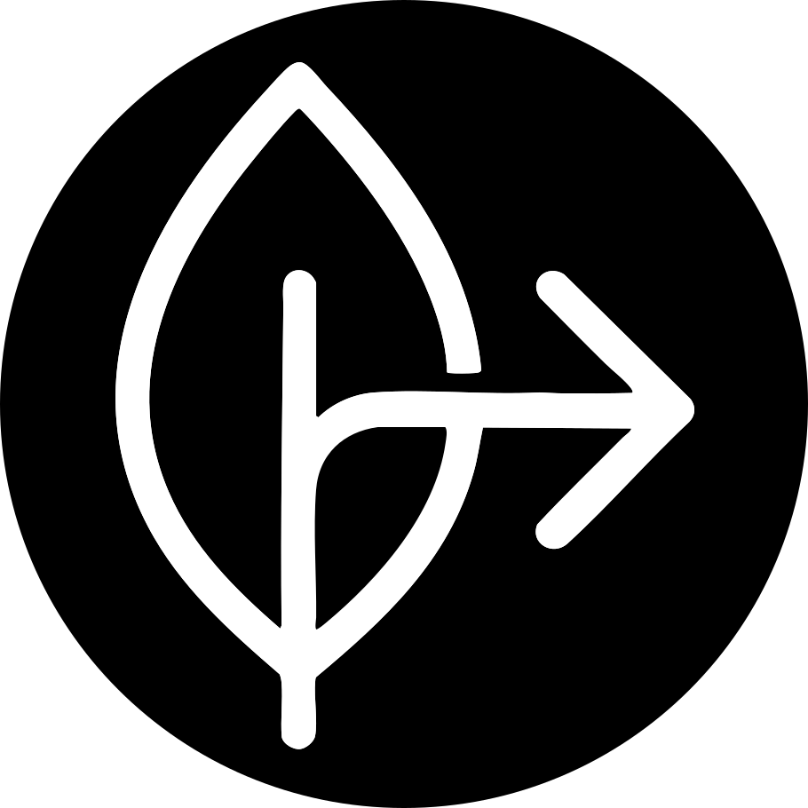
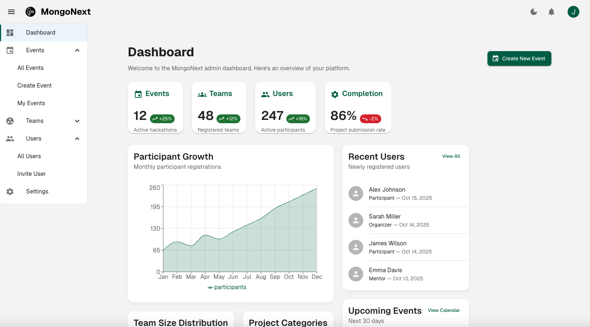
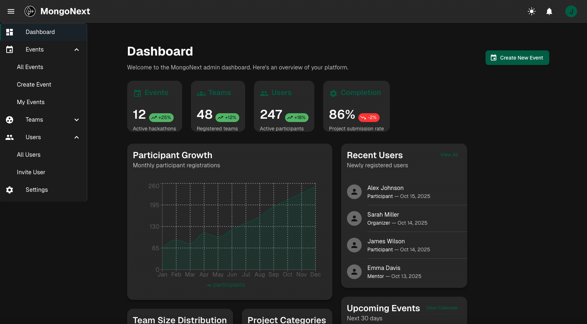
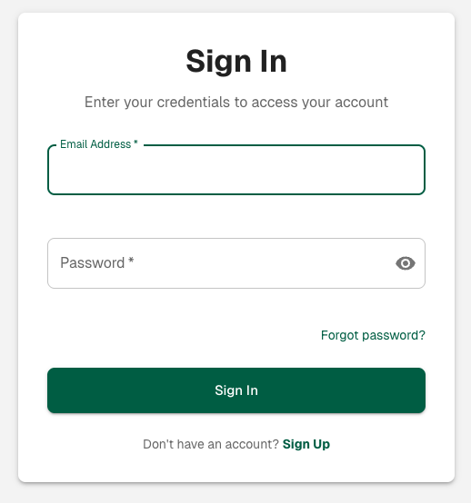
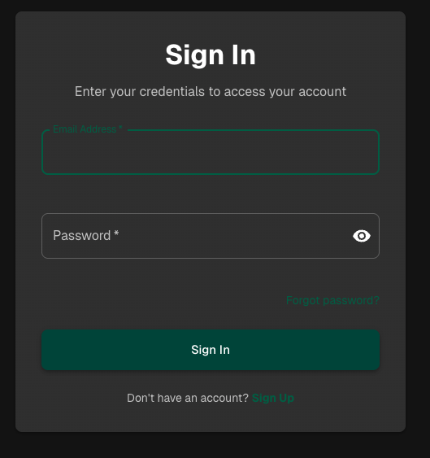

# MongoNext

<p align="center">
  
</p>

<p align="center">
  A professional, production-ready starter template for building modern web applications with Next.js and MongoDB
</p>

<p align="center">
  <a href="https://github.com/mrlynn/mongonext/stargazers"></a>
  <a href="https://github.com/mrlynn/mongonext/blob/main/LICENSE"></a>
  <a href="https://github.com/mrlynn/mongonext/releases"></a>
  
</p>

## ✨ Features

MongoNext combines the power of Next.js, MongoDB, React, and Material UI to provide a robust foundation for your projects:

- 🚀 **App Router Ready**: Built on Next.js with full App Router support
- 🎨 **Material UI**: Pre-configured theming and components
- 🌗 **Dark/Light Mode**: Fully integrated theme switcher
- 🔐 **Authentication**: Ready-to-use authentication flows with NextAuth.js
- 📱 **Responsive**: Mobile-first design principles throughout
- 📊 **Dashboard Layout**: Professional admin layout with sidebar navigation
- 🧩 **Component Library**: Extensive collection of pre-built UI components
- 🔧 **Developer Experience**: Configured with ESLint, Prettier, and Husky

## 📸 Screenshots

<table>
  <tr>
    <td>
      
      <p align="center">Dashboard (Light)</p>
    </td>
    <td>
      
      <p align="center">Dashboard (Dark)</p>
    </td>
  </tr>
  <tr>
    <td>
      
      <p align="center">Authentication (Light)</p>
    </td>
    <td>
      
      <p align="center">Authentication (Dark)</p>
    </td>
  </tr>
</table>

## 🚀 Quick Start

### Prerequisites

- Node.js 18 or later
- npm or yarn

### Installation

```bash
# Create a new project
npx create-next-app my-app -e https://github.com/mrlynn/mongonext

# Navigate to your new project
cd my-app

# Install dependencies
npm install

# Set up environment variables
cp .env.example .env.local
# Edit .env.local with your environment values

# Start the development server
npm run dev
```

Visit http://localhost:3000 to see your application.

## 🏗️ Project Structure

```
mongonext/
├── app/                      # Next.js App Router pages
│   ├── api/                  # API routes
│   ├── (auth)/               # Authentication pages
│   ├── dashboard/            # Dashboard pages
│   └── ...
├── components/               # Reusable components
│   ├── auth/                 # Authentication components
│   ├── dashboard/            # Dashboard components
│   ├── forms/                # Form components
│   ├── layout/               # Layout components
│   └── ui/                   # UI components
├── contexts/                 # React Context providers
├── hooks/                    # Custom React hooks
├── lib/                      # Utility functions and libraries
│   ├── auth/                 # Auth utilities
│   ├── api/                  # API utilities
│   └── db/                   # Database utilities
├── models/                   # Data models
├── public/                   # Static assets
└── styles/                   # Global styles
```

## 🎨 Customization

### Theme Configuration

The template comes with a fully customizable theme system. Edit the theme settings in `app/providers.js`:

```javascript
// Example of customizing the color palette
const theme = createTheme({
  palette: {
    primary: {
      main: '#1976d2', // Change to your brand color
    },
    secondary: {
      main: '#dc004e', // Change to your secondary color
    },
  },
});
```

### Adding Pages

Create new pages in the app directory following the Next.js App Router conventions:

```javascript
// app/about/page.js
export default function AboutPage() {
  return (
    <div>
      <h1>About Us</h1>
      <p>This is the about page.</p>
    </div>
  );
}
```

### Components

The template includes a comprehensive set of components. You can easily customize or extend them:

```javascript
// Example of customizing a component
import Button from '@/components/ui/Button';

// Use with custom props
<Button size="large" variant="outlined">
  Custom Button
</Button>
```

## 🔧 Advanced Configuration

### Authentication and User Management

MongoNext includes a full-featured user management system built on NextAuth.js with the following features:

- **Email/Password Authentication**: Traditional login method with secure password hashing
- **Social Login**: Optional integration with Google, GitHub, etc.
- **Email Verification**: Verify new accounts via email
- **Password Reset**: Secure password recovery workflow
- **User Profiles**: User profile management with customizable fields
- **Role-Based Access Control**: User roles (user, admin, moderator)
- **Protected Routes**: Route protection middleware with role checks
- **Session Management**: Persistent sessions with JWT

Configure your providers in `src/lib/auth/config.js`:

```javascript
// Add or modify authentication providers
export const authOptions = {
  providers: [
    CredentialsProvider({
      // Email/password login configuration
    }),
    GoogleProvider({
      clientId: process.env.GOOGLE_CLIENT_ID,
      clientSecret: process.env.GOOGLE_CLIENT_SECRET,
    }),
    // Add more providers here
  ],
  // ...
};
```

#### User Management API Endpoints

The template includes ready-to-use API routes for user management:

- **POST /api/auth/register**: Register a new user
- **POST/GET /api/auth/[...nextauth]**: NextAuth.js authentication endpoints
- **GET /api/auth/verify-email**: Verify user email with token
- **POST /api/auth/forgot-password**: Request password reset
- **POST /api/auth/reset-password**: Reset password with token
- **GET/PATCH /api/users/profile**: Get or update current user profile
- **POST /api/users/change-password**: Change user password

#### Client-Side Authentication

Use the included hooks and components to integrate authentication in your pages:

```javascript
// Client-side authentication with session context
import { useSessionContext } from '@/contexts/SessionContext';

function MyComponent() {
  const { user, isAuthenticated, isAdmin } = useSessionContext();
  
  if (!isAuthenticated) {
    return <p>Please log in</p>;
  }
  
  return <p>Welcome, {user.name}!</p>;
}
```

### Database Connection

Configure your MongoDB connection in `.env.local`:

```
MONGODB_URI=your_mongodb_connection_string
```

### API Routes

Create API routes in the `app/api` directory:

```javascript
// app/api/example/route.js
export async function GET(request) {
  // Your API logic here
  return Response.json({ message: 'Hello World' });
}
```

# Customizing the MongoNext Template

## 🧹 Removing Demo Features

The MongoNext template includes several demonstration features to help you understand its structure and capabilities. When you're ready to build your own application, you can easily remove these features:

### Using the Cleanup Script

We've included a convenient cleanup script to help you remove demonstration features:

```bash
npm run cleanup
```

This interactive script will:
1. Show you a list of demo features you can remove
2. Delete the selected files and directories
3. Update the sidebar navigation to remove references to deleted features

### Demo Features You Can Remove

- **Events**: Demo event management pages and components
- **Teams**: Demo team management pages and components
- **Users Admin**: Demo user management admin pages (keeps the core auth system)
- **Settings**: Demo settings pages
- **Admin Dashboard**: The sample admin dashboard with charts and stats

You can remove individual features or all of them at once, keeping only the essential framework.

## 🏗️ Adding Your Own Features

MongoNext includes a powerful code generation system using Plop.js that makes it easy to create new features.

### Using the Plop Generator

```bash
npm run plop
```

This command provides several generators:

- **feature**: Creates a complete feature with model, page, API route, and components
- **model**: Creates a new Mongoose model
- **page**: Creates a new Next.js page
- **api**: Creates a new API route
- **component**: Creates a new React component

### Example: Creating a Complete Feature

```bash
npm run plop feature
```

Follow the prompts to configure your feature:
- Feature name (e.g., "product")
- Feature description
- Include list view? Yes/No
- Include create form? Yes/No
- Include edit form? Yes/No
- Include delete functionality? Yes/No
- Add to sidebar navigation? Yes/No

This will generate:
- MongoDB model
- API endpoints (collection and individual item)
- Dashboard page
- List, form, and detail components
- Navigation items (if selected)

### Customizing Components and Pages

After generating the base code, you can customize the components and pages to match your specific needs. The generated code includes:

- Fully typed Mongoose models with JSDoc comments
- API routes with proper error handling
- React components with state management
- Form validation

## 🔄 Development Workflow

A typical workflow for customizing the MongoNext template:

1. **Clean up**: Remove demo features you don't need
   ```bash
   npm run cleanup
   ```

2. **Generate your features**: Use Plop to generate code for your needs
   ```bash
   npm run plop feature
   ```

3. **Customize**: Modify the generated code to match your requirements

4. **Test**: Run your application to test your changes
   ```bash
   npm run dev
   ```

## 📂 Understanding the File Structure

MongoNext follows a consistent file structure:

```
src/
├── app/                    # Next.js App Router pages and layouts
│   ├── api/                # API routes
│   ├── auth/               # Authentication pages
│   ├── admin/              # Admin panel pages
│   └── dashboard/          # User dashboard pages
├── components/             # React components
│   ├── ui/                 # Basic UI components
│   ├── layout/             # Layout components
│   ├── forms/              # Form components
│   └── feature-specific/   # Components for specific features
├── lib/                    # Utilities and services
│   ├── api/                # API utilities
│   ├── auth/               # Auth utilities
│   ├── db/                 # Database utilities
│   └── services/           # Business logic services
└── models/                 # Mongoose models
```

For more detailed information on customizing your MongoNext application, refer to our [customization guide](docs/getting-started/customizing.md).

## 📚 Documentation

For more detailed documentation, visit our [official documentation site](https://github.com/yourusername/mongonext/wiki).

## 🤝 Contributing

Contributions are welcome! Please feel free to submit a Pull Request.

1. Fork the repository
2. Create your feature branch (`git checkout -b feature/amazing-feature`)
3. Commit your changes (`git commit -m 'Add some amazing feature'`)
4. Push to the branch (`git push origin feature/amazing-feature`)
5. Open a Pull Request

Read our [contributing guidelines](CONTRIBUTING.md) for more information.

## 📝 License

This project is licensed under the MIT License - see the [LICENSE](LICENSE) file for details.

## 💖 Acknowledgements

- [Next.js](https://nextjs.org/) - The React Framework
- [Material UI](https://mui.com/) - UI Component Library
- [MongoDB](https://www.mongodb.com/) - Database
- [NextAuth.js](https://next-auth.js.org/) - Authentication
- [React Hook Form](https://react-hook-form.com/) - Form Validation

---

<p align="center">
  Made with ❤️ by <a href="https://github.com/mrlynn"> Michael Lynn</a>
</p>

## Environment Variables

The following environment variables are required:

- `MONGODB_URI`: Your MongoDB connection string
- `NEXTAUTH_SECRET`: A secret key for NextAuth.js session encryption
- `NEXTAUTH_URL`: The base URL of your application
- `AUTH_REQUIRED`: Set to 'false' to disable authentication requirements (defaults to 'true')